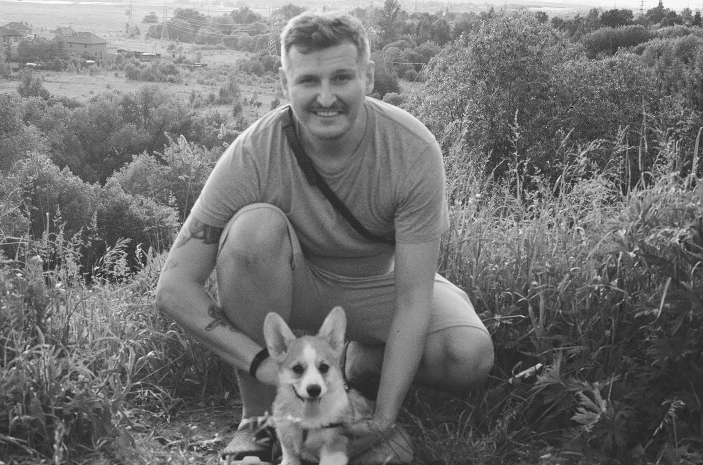

## Меня зовут Антон
### 

#### **читайте** [Лао-цзы](https://ozon.ru/t/MGb1dD7)

>У меня есть ***три сокровища***, которые нужно ценить и беречь:
Первое — это любовь, второе — это сдержанная простота, а третье — это то, что я не осмеливаюсь ставить себя прежде других.
Я испытываю любовь, поэтому могу быть храбрым.
Я прост, поэтому могу быть великодушным и щедрым.
Я не осмеливаюсь ставить себя прежде других, поэтому могу быть впереди всего сущего.
Стремящегося храбрости без любви, к великодушию без простоты, к первенству без уступок, ждёт один результат — гибель!
Тот, кто ведет войну, помня о любви милосердии, тот побеждает.
А его защита прочна и неприступна.
И само Небо спасает такого человека, и сама любовь его оберегает.